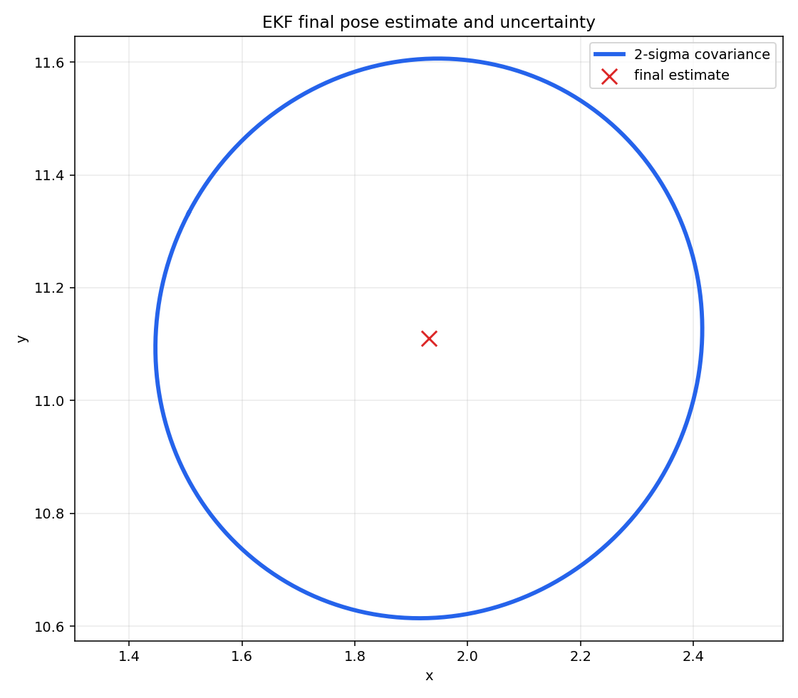

# EKF Localization

Extended Kalman Filter localization with odometry prediction and range-bearing landmark corrections. The code also simulates sensor failures and frequency mismatch between odometry and landmark observations.

## Run

```bash
python - <<'PY'
import mobile_robotics_ekf_localization as ekf_localization

mu, covariance, last_control = ekf_localization.run_ekf_localization(plot=False, step_size=100, last_step=400)
print("mu:", mu)
print("covariance diagonal:", covariance.diagonal())
PY
```

## Result screenshots



Final EKF pose estimate with a covariance ellipse from the bundled landmark dataset.


## What this demonstrates

- Odometry prediction and range-bearing landmark correction in an EKF loop.
- Handling of sensor cadence mismatch and simulated observation failures.
- Uncertainty tracking through covariance propagation and correction.


## Limitations and next steps

- The implementation assumes known landmark correspondences.
- The current README focuses on a short offline run rather than long-run metrics.
- Next steps: add NEES/RMSE plots and compare against particle-filter localization.

